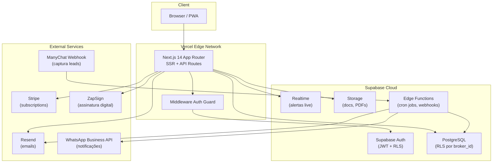

# Lucky SaaS — Fullstack Architecture

**Versão:** 1.0  
**Data:** 2026-05-07  
**Status:** Aprovado para implementação  
**Arquiteto:** Equipe AI-Native (Aria + Dara)

---

## 1. Visão Geral da Arquitetura

O Lucky SaaS é uma aplicação web multi-tenant SaaS com arquitetura de três camadas: frontend Next.js (SSR/CSR híbrido), backend Supabase (PostgreSQL + Auth + Realtime + Storage), e serviços externos de integração.

### Diagrama de Alto Nível



### Fluxo de Request Padrão

```
Browser → Vercel Edge → Next.js Middleware (verifica JWT)
    → Route Handler / Server Component
        → Supabase Client (com RLS automático por broker_id)
            → PostgreSQL → Response
```

---

## 2. Stack Técnica Detalhada

| Camada | Tecnologia | Versão | Motivo |
|--------|-----------|--------|--------|
| Framework | Next.js App Router | 14.x | SSR, API Routes, Server Actions, Middleware |
| Linguagem | TypeScript | 5.x | Type safety end-to-end |
| Estilização | Tailwind CSS | 3.x | Utility-first, consistente com design system |
| Componentes | shadcn/ui (customizado) | latest | Acessibilidade, customizável, sem lock-in |
| Drag-and-drop | @dnd-kit/core | 6.x | Kanban do pipeline; performático, acessível |
| Formulários | React Hook Form + Zod | latest | Validação type-safe, performance |
| Estado server | TanStack Query | 5.x | Cache, refetch, otimismo UI |
| Estado cliente | Zustand | 4.x | Leve, para UI state (drawer aberto, filtros) |
| PDF | react-pdf / pdfmake | latest | Geração de propostas no frontend |
| Gráficos | Recharts | latest | Forecast e relatórios financeiros |
| Backend | Supabase | latest | PostgreSQL + Auth + RLS + Realtime + Storage |
| Auth | Supabase Auth | — | JWT, Google OAuth, email/senha |
| Database | PostgreSQL 15 | — | Via Supabase Cloud |
| Cron jobs | Supabase Edge Functions | — | Processar alertas diários |
| Email | Resend | — | Transacional (alerts, welcome, billing) |
| Pagamentos | Stripe | — | Subscriptions mensais, portal billing |
| Assinatura | ZapSign | — | Integração via REST API |
| Deploy | Vercel | — | CI/CD automático, preview deploys |
| Monitoramento | Vercel Analytics + Sentry | — | Performance, errors |

---

## 3. Estrutura de Pastas do Projeto

```
lucky-saas/
├── app/                                    # Next.js App Router
│   ├── (auth)/                             # Rotas públicas (auth layout)
│   │   ├── login/
│   │   │   └── page.tsx
│   │   ├── signup/
│   │   │   └── page.tsx
│   │   └── layout.tsx
│   │
│   ├── (app)/                              # Rotas protegidas (app layout)
│   │   ├── layout.tsx                      # Sidebar + Header
│   │   ├── dashboard/
│   │   │   └── page.tsx                    # Dashboard principal (alertas hoje)
│   │   ├── pipeline/
│   │   │   ├── page.tsx                    # Kanban de leads
│   │   │   └── [leadId]/
│   │   │       └── page.tsx               # Detalhe do lead
│   │   ├── apolices/
│   │   │   ├── page.tsx                    # Lista de apólices
│   │   │   ├── nova/
│   │   │   │   └── page.tsx               # Cadastro de apólice
│   │   │   └── [apoliceId]/
│   │   │       └── page.tsx               # Detalhe da apólice
│   │   ├── clientes/
│   │   │   ├── page.tsx                    # Lista de clientes
│   │   │   ├── novo/
│   │   │   │   └── page.tsx               # Cadastro de cliente
│   │   │   └── [clienteId]/
│   │   │       └── page.tsx               # Perfil completo do cliente
│   │   ├── cross-sell/
│   │   │   └── page.tsx                    # Lista de oportunidades
│   │   ├── alertas/
│   │   │   └── page.tsx                    # Central de alertas
│   │   ├── financeiro/
│   │   │   ├── page.tsx                    # Dashboard financeiro + forecast
│   │   │   ├── comissoes/
│   │   │   │   └── page.tsx               # Registro e rastreio de comissões
│   │   │   └── relatorios/
│   │   │       └── page.tsx               # Relatórios por ramo/seguradora
│   │   ├── processos/
│   │   │   ├── page.tsx                    # Lista de processos de abertura
│   │   │   └── [processoId]/
│   │   │       └── page.tsx               # Checklist + proposta + assinatura
│   │   └── configuracoes/
│   │       ├── page.tsx                    # Perfil do corretor
│   │       ├── integrações/
│   │       │   └── page.tsx               # ManyChat webhook, WhatsApp
│   │       ├── templates/
│   │       │   └── page.tsx               # Templates de mensagem e proposta
│   │       ├── importacao/
│   │       │   └── page.tsx               # Import CSV
│   │       └── plano/
│   │           └── page.tsx               # Billing, Stripe portal
│   │
│   ├── api/                                # Route Handlers (API)
│   │   ├── webhooks/
│   │   │   ├── stripe/
│   │   │   │   └── route.ts               # Stripe webhook (subscription events)
│   │   │   ├── manychat/
│   │   │   │   └── route.ts               # ManyChat lead capture
│   │   │   └── zapsign/
│   │   │       └── route.ts               # ZapSign signature events
│   │   ├── pdf/
│   │   │   └── proposta/
│   │   │       └── route.ts               # Geração de PDF de proposta
│   │   └── importacao/
│   │       └── csv/
│   │           └── route.ts               # Processing de CSV upload
│   │
│   ├── middleware.ts                        # Auth guard global
│   └── layout.tsx                          # Root layout (fonts, providers)
│
├── components/
│   ├── ui/                                 # shadcn/ui base components
│   │   ├── button.tsx
│   │   ├── card.tsx
│   │   ├── dialog.tsx
│   │   ├── drawer.tsx
│   │   ├── input.tsx
│   │   ├── badge.tsx
│   │   ├── table.tsx
│   │   └── ...
│   │
│   ├── layout/
│   │   ├── sidebar.tsx                     # Sidebar dark #0D0D0D
│   │   ├── header.tsx                      # Topbar com user menu
│   │   └── mobile-nav.tsx                  # Nav mobile
│   │
│   ├── dashboard/
│   │   ├── alertas-hoje.tsx                # Card de alertas do dia
│   │   ├── forecast-widget.tsx             # Preview de comissões
│   │   ├── pipeline-summary.tsx            # Resumo do pipeline
│   │   └── cross-sell-highlight.tsx        # Destaque de oportunidades
│   │
│   ├── pipeline/
│   │   ├── kanban-board.tsx                # Board principal (dnd-kit)
│   │   ├── kanban-column.tsx               # Coluna individual
│   │   ├── lead-card.tsx                   # Card draggável
│   │   ├── lead-drawer.tsx                 # Drawer de detalhe
│   │   └── lead-form.tsx                   # Formulário novo lead
│   │
│   ├── apolices/
│   │   ├── apolice-table.tsx               # Tabela com filtros
│   │   ├── apolice-form.tsx                # Formulário completo
│   │   ├── vencimento-badge.tsx            # Badge 90/60/30d
│   │   └── alerta-renovacao.tsx            # Card de alerta de renovação
│   │
│   ├── clientes/
│   │   ├── cliente-profile.tsx             # Layout do perfil
│   │   ├── cliente-apolices.tsx            # Lista de apólices do cliente
│   │   └── cliente-timeline.tsx            # Timeline de eventos
│   │
│   ├── cross-sell/
│   │   ├── oportunidade-card.tsx           # Card com score
│   │   ├── score-badge.tsx                 # Badge de propensão (1-5 estrelas)
│   │   └── alerta-sazonal.tsx              # Banner de oportunidade sazonal
│   │
│   ├── financeiro/
│   │   ├── forecast-chart.tsx              # Gráfico mensal (Recharts)
│   │   ├── comissao-table.tsx              # Tabela de comissões
│   │   └── relatorio-table.tsx             # Relatório por seguradora
│   │
│   └── shared/
│       ├── whatsapp-button.tsx             # Botão universal de WhatsApp
│       ├── csv-importer.tsx                # Wizard de importação
│       ├── empty-state.tsx                 # Estados vazios padronizados
│       └── loading-skeleton.tsx            # Skeletons padrão
│
├── lib/
│   ├── supabase/
│   │   ├── client.ts                       # Browser client (singleton)
│   │   ├── server.ts                       # Server client (cookies)
│   │   ├── middleware.ts                   # Refresh session helper
│   │   └── types.ts                        # Database.ts gerado pelo Supabase CLI
│   │
│   ├── stripe/
│   │   ├── client.ts                       # Stripe instance
│   │   ├── plans.ts                        # Definição dos planos
│   │   └── webhooks.ts                     # Handler de eventos Stripe
│   │
│   ├── zapsign/
│   │   └── client.ts                       # ZapSign API wrapper
│   │
│   ├── resend/
│   │   ├── client.ts                       # Resend instance
│   │   └── templates/                      # Templates de email (React Email)
│   │       ├── alerta-vencimento.tsx
│   │       ├── boas-vindas.tsx
│   │       └── confirmacao-importacao.tsx
│   │
│   ├── validations/
│   │   ├── apolice.ts                      # Zod schemas
│   │   ├── cliente.ts
│   │   ├── lead.ts
│   │   └── comissao.ts
│   │
│   ├── utils/
│   │   ├── currency.ts                     # Formatação BRL
│   │   ├── dates.ts                        # Cálculo de vencimentos, dias restantes
│   │   ├── commission.ts                   # Cálculo de comissão
│   │   ├── cross-sell-score.ts             # Algoritmo de score de propensão
│   │   └── csv-parser.ts                   # Parser de importação CSV
│   │
│   └── constants/
│       ├── ramos.ts                        # Lista de ramos de seguro
│       ├── seguradoras.ts                  # Lista de seguradoras
│       └── checklist-ramos.ts             # Checklists por ramo
│
├── hooks/
│   ├── use-leads.ts                        # TanStack Query + Supabase leads
│   ├── use-apolices.ts
│   ├── use-clientes.ts
│   ├── use-alertas.ts
│   ├── use-comissoes.ts
│   ├── use-realtime-alerts.ts              # Supabase Realtime subscription
│   └── use-forecast.ts                     # Cálculo de forecast client-side
│
├── stores/
│   ├── ui-store.ts                         # Zustand: drawers, modais, filtros ativos
│   └── alert-store.ts                      # Zustand: alertas não lidos
│
├── supabase/
│   ├── migrations/                         # SQL migrations versionadas
│   │   ├── 0001_initial_schema.sql
│   │   ├── 0002_rls_policies.sql
│   │   ├── 0003_alertas_functions.sql
│   │   └── 0004_cross_sell_views.sql
│   ├── functions/                          # Edge Functions
│   │   ├── process-daily-alerts/           # Cron diário de alertas
│   │   │   └── index.ts
│   │   ├── webhook-manychat/               # Captura de leads ManyChat
│   │   │   └── index.ts
│   │   └── webhook-zapsign/                # Callback de assinatura
│   │       └── index.ts
│   └── seed.sql                            # Dados iniciais (ramos, seguradoras)
│
├── public/
│   ├── icons/                              # Ícones do app
│   ├── manifest.json                       # PWA manifest
│   └── sw.js                               # Service Worker (PWA)
│
├── DESIGN.md                               # Design system Lucky SaaS
├── .env.local                              # Variáveis de ambiente (não commitado)
├── .env.example                            # Template de variáveis
├── next.config.ts
├── tailwind.config.ts
├── tsconfig.json
└── package.json
```

---

## 4. Schema do Banco de Dados

### Tabelas Principais

```sql
-- ============================================================
-- BROKERS (Corretores) — um por workspace/tenant
-- ============================================================
CREATE TABLE brokers (
    id          UUID PRIMARY KEY DEFAULT gen_random_uuid(),
    user_id     UUID NOT NULL REFERENCES auth.users(id) ON DELETE CASCADE,
    name        TEXT NOT NULL,
    creci       TEXT,                          -- Número SUSEP/CRECI
    phone       TEXT,
    email       TEXT NOT NULL,
    logo_url    TEXT,                          -- Storage URL do logo
    plan        TEXT NOT NULL DEFAULT 'starter' CHECK (plan IN ('starter', 'pro', 'broker')),
    stripe_customer_id TEXT,
    stripe_subscription_id TEXT,
    subscription_status TEXT DEFAULT 'trialing',
    trial_ends_at TIMESTAMPTZ,
    settings    JSONB NOT NULL DEFAULT '{}',   -- Configurações do workspace
    created_at  TIMESTAMPTZ DEFAULT NOW(),
    updated_at  TIMESTAMPTZ DEFAULT NOW()
);

-- Índices
CREATE INDEX idx_brokers_user_id ON brokers(user_id);
CREATE INDEX idx_brokers_stripe_customer ON brokers(stripe_customer_id);

-- ============================================================
-- CLIENTS (Clientes do corretor)
-- ============================================================
CREATE TABLE clients (
    id          UUID PRIMARY KEY DEFAULT gen_random_uuid(),
    broker_id   UUID NOT NULL REFERENCES brokers(id) ON DELETE CASCADE,
    name        TEXT NOT NULL,
    cpf_cnpj    TEXT,
    email       TEXT,
    phone       TEXT NOT NULL,
    birth_date  DATE,                          -- Para alertas de aniversário
    address     JSONB,                         -- {street, city, state, zip}
    tags        TEXT[] DEFAULT '{}',           -- Tags livres
    notes       TEXT,
    created_at  TIMESTAMPTZ DEFAULT NOW(),
    updated_at  TIMESTAMPTZ DEFAULT NOW()
);

CREATE INDEX idx_clients_broker_id ON clients(broker_id);
CREATE INDEX idx_clients_name ON clients(broker_id, name);
CREATE INDEX idx_clients_birth_date ON clients(birth_date) WHERE birth_date IS NOT NULL;

-- ============================================================
-- LEADS (Pipeline de vendas)
-- ============================================================
CREATE TABLE leads (
    id              UUID PRIMARY KEY DEFAULT gen_random_uuid(),
    broker_id       UUID NOT NULL REFERENCES brokers(id) ON DELETE CASCADE,
    client_id       UUID REFERENCES clients(id) ON DELETE SET NULL, -- null até converter
    name            TEXT NOT NULL,
    phone           TEXT NOT NULL,
    email           TEXT,
    ramo            TEXT,                      -- Ramo de interesse
    status          TEXT NOT NULL DEFAULT 'novo'
                    CHECK (status IN ('novo', 'cotacao_enviada', 'negociacao', 'fechado', 'perdido')),
    source          TEXT DEFAULT 'manual'
                    CHECK (source IN ('manual', 'manychat', 'instagram', 'indicacao', 'site')),
    last_activity_at TIMESTAMPTZ DEFAULT NOW(),
    closed_at       TIMESTAMPTZ,
    lost_reason     TEXT,
    notes           TEXT,
    metadata        JSONB DEFAULT '{}',        -- Dados extras do ManyChat
    created_at      TIMESTAMPTZ DEFAULT NOW(),
    updated_at      TIMESTAMPTZ DEFAULT NOW()
);

CREATE INDEX idx_leads_broker_id ON leads(broker_id);
CREATE INDEX idx_leads_status ON leads(broker_id, status);
CREATE INDEX idx_leads_last_activity ON leads(last_activity_at);

-- ============================================================
-- POLICIES (Apólices)
-- ============================================================
CREATE TABLE policies (
    id                  UUID PRIMARY KEY DEFAULT gen_random_uuid(),
    broker_id           UUID NOT NULL REFERENCES brokers(id) ON DELETE CASCADE,
    client_id           UUID NOT NULL REFERENCES clients(id) ON DELETE RESTRICT,
    policy_number       TEXT,                  -- Número da apólice na seguradora
    ramo                TEXT NOT NULL,         -- 'auto', 'vida', 'residencial', 'empresarial', 'viagem', etc.
    seguradora          TEXT NOT NULL,         -- 'porto_seguro', 'bradesco', 'sulamérica', etc.
    start_date          DATE NOT NULL,
    end_date            DATE NOT NULL,
    premium_total       NUMERIC(12,2) NOT NULL, -- Prêmio total em R$
    payment_frequency   TEXT DEFAULT 'anual'
                        CHECK (payment_frequency IN ('mensal', 'trimestral', 'semestral', 'anual')),
    installments        INTEGER DEFAULT 1,
    commission_pct      NUMERIC(5,2) NOT NULL, -- % de comissão
    commission_expected NUMERIC(12,2) GENERATED ALWAYS AS (premium_total * commission_pct / 100) STORED,
    commission_type     TEXT DEFAULT 'angariacao'
                        CHECK (commission_type IN ('angariacao', 'renovacao', 'mista')),
    status              TEXT NOT NULL DEFAULT 'ativa'
                        CHECK (status IN ('ativa', 'vencida', 'cancelada', 'suspensa', 'renovada')),
    parent_policy_id    UUID REFERENCES policies(id), -- ID da apólice anterior (renovação)
    notes               TEXT,
    metadata            JSONB DEFAULT '{}',
    created_at          TIMESTAMPTZ DEFAULT NOW(),
    updated_at          TIMESTAMPTZ DEFAULT NOW()
);

CREATE INDEX idx_policies_broker_id ON policies(broker_id);
CREATE INDEX idx_policies_client_id ON policies(client_id);
CREATE INDEX idx_policies_end_date ON policies(end_date) WHERE status = 'ativa';
CREATE INDEX idx_policies_ramo ON policies(broker_id, ramo);
CREATE INDEX idx_policies_seguradora ON policies(broker_id, seguradora);
CREATE UNIQUE INDEX idx_policies_number_seguradora ON policies(broker_id, policy_number, seguradora)
    WHERE policy_number IS NOT NULL;

-- ============================================================
-- COMMISSIONS (Rastreio de comissões)
-- ============================================================
CREATE TABLE commissions (
    id                  UUID PRIMARY KEY DEFAULT gen_random_uuid(),
    broker_id           UUID NOT NULL REFERENCES brokers(id) ON DELETE CASCADE,
    policy_id           UUID NOT NULL REFERENCES policies(id) ON DELETE CASCADE,
    expected_amount     NUMERIC(12,2) NOT NULL,
    received_amount     NUMERIC(12,2),         -- null = não recebido ainda
    expected_date       DATE NOT NULL,
    received_date       DATE,
    status              TEXT NOT NULL DEFAULT 'pendente'
                        CHECK (status IN ('pendente', 'recebido', 'parcial', 'atrasado', 'cancelado')),
    divergence_amount   NUMERIC(12,2) GENERATED ALWAYS AS (
                            CASE WHEN received_amount IS NOT NULL
                            THEN received_amount - expected_amount
                            ELSE NULL END
                        ) STORED,
    reference_month     TEXT,                  -- 'YYYY-MM' para agrupamento
    notes               TEXT,
    created_at          TIMESTAMPTZ DEFAULT NOW(),
    updated_at          TIMESTAMPTZ DEFAULT NOW()
);

CREATE INDEX idx_commissions_broker_id ON commissions(broker_id);
CREATE INDEX idx_commissions_policy_id ON commissions(policy_id);
CREATE INDEX idx_commissions_expected_date ON commissions(expected_date);
CREATE INDEX idx_commissions_status ON commissions(broker_id, status);
CREATE INDEX idx_commissions_reference_month ON commissions(broker_id, reference_month);

-- ============================================================
-- ALERTS (Alertas gerados pelo sistema)
-- ============================================================
CREATE TABLE alerts (
    id          UUID PRIMARY KEY DEFAULT gen_random_uuid(),
    broker_id   UUID NOT NULL REFERENCES brokers(id) ON DELETE CASCADE,
    type        TEXT NOT NULL CHECK (type IN (
                    'renovacao_90d', 'renovacao_60d', 'renovacao_30d',
                    'aniversario_cliente', 'aniversario_apolice',
                    'lead_parado', 'comissao_pendente',
                    'cross_sell', 'evento_vida'
                )),
    entity_type TEXT NOT NULL CHECK (entity_type IN ('policy', 'client', 'lead', 'commission')),
    entity_id   UUID NOT NULL,
    status      TEXT NOT NULL DEFAULT 'pendente'
                CHECK (status IN ('pendente', 'visto', 'contatado', 'dispensado')),
    scheduled_for DATE NOT NULL,
    actioned_at TIMESTAMPTZ,
    metadata    JSONB DEFAULT '{}',            -- Dados extras (template WhatsApp, etc.)
    created_at  TIMESTAMPTZ DEFAULT NOW()
);

CREATE INDEX idx_alerts_broker_id ON alerts(broker_id);
CREATE INDEX idx_alerts_scheduled_for ON alerts(scheduled_for) WHERE status = 'pendente';
CREATE INDEX idx_alerts_type ON alerts(broker_id, type, status);
CREATE INDEX idx_alerts_entity ON alerts(entity_type, entity_id);

-- ============================================================
-- CLIENT_EVENTS (Eventos de vida do cliente)
-- ============================================================
CREATE TABLE client_events (
    id          UUID PRIMARY KEY DEFAULT gen_random_uuid(),
    broker_id   UUID NOT NULL REFERENCES brokers(id) ON DELETE CASCADE,
    client_id   UUID NOT NULL REFERENCES clients(id) ON DELETE CASCADE,
    type        TEXT NOT NULL CHECK (type IN (
                    'nascimento_filho', 'casamento', 'compra_imovel',
                    'aposentadoria', 'formatura', 'outro'
                )),
    event_date  DATE NOT NULL,
    description TEXT,
    alert_sent  BOOLEAN DEFAULT FALSE,
    created_at  TIMESTAMPTZ DEFAULT NOW()
);

CREATE INDEX idx_client_events_broker_id ON client_events(broker_id);
CREATE INDEX idx_client_events_event_date ON client_events(event_date);

-- ============================================================
-- CROSS_SELL_OPPORTUNITIES (Oportunidades de cross-sell)
-- ============================================================
CREATE TABLE cross_sell_opportunities (
    id              UUID PRIMARY KEY DEFAULT gen_random_uuid(),
    broker_id       UUID NOT NULL REFERENCES brokers(id) ON DELETE CASCADE,
    client_id       UUID NOT NULL REFERENCES clients(id) ON DELETE CASCADE,
    current_ramo    TEXT NOT NULL,             -- Produto que já tem
    suggested_ramo  TEXT NOT NULL,             -- Produto sugerido
    reason          TEXT NOT NULL,             -- Explicação do motivo
    score           INTEGER NOT NULL CHECK (score BETWEEN 1 AND 5),
    status          TEXT NOT NULL DEFAULT 'aberta'
                    CHECK (status IN ('aberta', 'em_andamento', 'fechada', 'perdida', 'dispensada')),
    result_policy_id UUID REFERENCES policies(id), -- Apólice resultante se fechou
    lost_reason     TEXT,
    snoozed_until   DATE,                      -- Para dispensar por 90 dias
    notes           TEXT,
    created_at      TIMESTAMPTZ DEFAULT NOW(),
    updated_at      TIMESTAMPTZ DEFAULT NOW()
);

CREATE INDEX idx_cross_sell_broker_id ON cross_sell_opportunities(broker_id);
CREATE INDEX idx_cross_sell_status ON cross_sell_opportunities(broker_id, status);
CREATE INDEX idx_cross_sell_client ON cross_sell_opportunities(client_id);

-- ============================================================
-- PROCESSES (Processos de abertura/fechamento)
-- ============================================================
CREATE TABLE processes (
    id              UUID PRIMARY KEY DEFAULT gen_random_uuid(),
    broker_id       UUID NOT NULL REFERENCES brokers(id) ON DELETE CASCADE,
    client_id       UUID NOT NULL REFERENCES clients(id) ON DELETE RESTRICT,
    policy_id       UUID REFERENCES policies(id),
    ramo            TEXT NOT NULL,
    status          TEXT NOT NULL DEFAULT 'em_andamento'
                    CHECK (status IN ('em_andamento', 'pendente_assinatura', 'concluido', 'cancelado')),
    checklist       JSONB NOT NULL DEFAULT '{}', -- {item_id: {checked: bool, checked_at: ts}}
    proposal_pdf_url TEXT,                     -- Storage URL
    zapsign_doc_id  TEXT,                      -- ID do documento na ZapSign
    zapsign_status  TEXT,
    signed_pdf_url  TEXT,
    welcome_sent    BOOLEAN DEFAULT FALSE,
    notes           TEXT,
    created_at      TIMESTAMPTZ DEFAULT NOW(),
    updated_at      TIMESTAMPTZ DEFAULT NOW()
);

CREATE INDEX idx_processes_broker_id ON processes(broker_id);
CREATE INDEX idx_processes_client_id ON processes(client_id);
CREATE INDEX idx_processes_status ON processes(broker_id, status);

-- ============================================================
-- LEAD_ACTIVITIES (Histórico do lead)
-- ============================================================
CREATE TABLE lead_activities (
    id          UUID PRIMARY KEY DEFAULT gen_random_uuid(),
    lead_id     UUID NOT NULL REFERENCES leads(id) ON DELETE CASCADE,
    broker_id   UUID NOT NULL REFERENCES brokers(id) ON DELETE CASCADE,
    type        TEXT NOT NULL CHECK (type IN ('status_change', 'note', 'call', 'email', 'whatsapp')),
    description TEXT NOT NULL,
    old_value   TEXT,                          -- Status anterior (para mudanças)
    new_value   TEXT,                          -- Novo status
    created_at  TIMESTAMPTZ DEFAULT NOW()
);

CREATE INDEX idx_lead_activities_lead_id ON lead_activities(lead_id);
CREATE INDEX idx_lead_activities_broker_id ON lead_activities(broker_id);

-- ============================================================
-- BROKER_USERS (Multi-usuário no tier Broker)
-- ============================================================
CREATE TABLE broker_users (
    id          UUID PRIMARY KEY DEFAULT gen_random_uuid(),
    broker_id   UUID NOT NULL REFERENCES brokers(id) ON DELETE CASCADE,
    user_id     UUID NOT NULL REFERENCES auth.users(id) ON DELETE CASCADE,
    role        TEXT NOT NULL DEFAULT 'assistant'
                CHECK (role IN ('owner', 'assistant')),
    invited_at  TIMESTAMPTZ DEFAULT NOW(),
    accepted_at TIMESTAMPTZ,
    UNIQUE(broker_id, user_id)
);

CREATE INDEX idx_broker_users_user_id ON broker_users(user_id);
CREATE INDEX idx_broker_users_broker_id ON broker_users(broker_id);
```

### Views Importantes

```sql
-- Forecast de comissões do mês atual
CREATE VIEW v_forecast_current_month AS
SELECT
    broker_id,
    reference_month,
    SUM(expected_amount) AS total_esperado,
    SUM(received_amount) FILTER (WHERE status = 'recebido') AS total_recebido,
    COUNT(*) FILTER (WHERE status = 'pendente') AS qtd_pendentes,
    COUNT(*) FILTER (WHERE status = 'atrasado') AS qtd_atrasados
FROM commissions
WHERE reference_month = TO_CHAR(NOW(), 'YYYY-MM')
GROUP BY broker_id, reference_month;

-- Apólices vencendo nos próximos 90 dias
CREATE VIEW v_policies_expiring_soon AS
SELECT
    p.*,
    c.name AS client_name,
    c.phone AS client_phone,
    c.email AS client_email,
    (p.end_date - CURRENT_DATE) AS days_remaining
FROM policies p
JOIN clients c ON c.id = p.client_id
WHERE p.status = 'ativa'
  AND p.end_date BETWEEN CURRENT_DATE AND CURRENT_DATE + INTERVAL '90 days'
ORDER BY p.end_date ASC;

-- Oportunidades de cross-sell calculadas dinamicamente
CREATE VIEW v_cross_sell_gaps AS
SELECT
    c.id AS client_id,
    c.broker_id,
    c.name AS client_name,
    ARRAY_AGG(DISTINCT p.ramo) AS ramos_ativos,
    COUNT(p.id) AS qtd_apolices
FROM clients c
JOIN policies p ON p.client_id = c.id AND p.status = 'ativa'
GROUP BY c.id, c.broker_id, c.name;
```

---

## 5. Fluxo de Autenticação e Multi-tenancy

### Fluxo de Autenticação

```
1. SIGNUP
   User → /signup → Supabase Auth signUp() → auth.users criado
   → Trigger: after_user_created → INSERT INTO brokers(user_id, email, name)
   → Redirect → /dashboard (com session JWT)

2. LOGIN
   User → /login → Supabase Auth signInWithPassword()
   → JWT contém: sub (user_id), broker_id (via custom claim)
   → Middleware Next.js verifica JWT → passa para Server Components
   → Supabase RLS usa auth.uid() para filtrar dados

3. GOOGLE OAUTH
   User → /login → signInWithOAuth({provider: 'google'})
   → Callback: /auth/callback → exchange code → session estabelecida
   → Mesmo trigger after_user_created se primeiro login

4. SESSION MANAGEMENT
   - Access token: 1 hora (padrão Supabase)
   - Refresh token: 7 dias
   - Middleware Next.js: refreshSession() a cada request se token < 60min restantes
```

### Resolução de broker_id

```typescript
// lib/supabase/server.ts
export async function getBrokerId(): Promise<string> {
    const supabase = createServerClient();
    const { data: { user } } = await supabase.auth.getUser();
    if (!user) throw new Error('Unauthenticated');

    const { data: broker } = await supabase
        .from('brokers')
        .select('id')
        .eq('user_id', user.id)
        .single();

    // Para broker_users (assistentes):
    // Verificar também broker_users onde user_id = user.id

    return broker.id;
}
```

### Multi-tenancy: Isolamento por broker_id

O isolamento é garantido em duas camadas:

**Camada 1 — RLS no PostgreSQL (inviolável no banco)**
**Camada 2 — Middleware Next.js (defesa em profundidade)**

Nunca confiar apenas no client-side. Toda query passa pelo RLS server-side.

---

## 6. Row Level Security (RLS) — Estratégia Completa

### Função Helper

```sql
-- Retorna o broker_id do usuário autenticado (resolvendo owner ou assistant)
CREATE OR REPLACE FUNCTION auth.broker_id() RETURNS UUID AS $$
DECLARE
    v_broker_id UUID;
BEGIN
    -- Verifica se é owner direto
    SELECT id INTO v_broker_id
    FROM brokers
    WHERE user_id = auth.uid();

    -- Se não encontrou como owner, verifica se é assistant
    IF v_broker_id IS NULL THEN
        SELECT broker_id INTO v_broker_id
        FROM broker_users
        WHERE user_id = auth.uid()
          AND accepted_at IS NOT NULL;
    END IF;

    RETURN v_broker_id;
END;
$$ LANGUAGE plpgsql SECURITY DEFINER STABLE;
```

### Policies por Tabela

```sql
-- BROKERS: owner vê e edita apenas seu próprio workspace
ALTER TABLE brokers ENABLE ROW LEVEL SECURITY;

CREATE POLICY "broker_own_data" ON brokers
    FOR ALL
    USING (user_id = auth.uid());

-- CLIENTS
ALTER TABLE clients ENABLE ROW LEVEL SECURITY;

CREATE POLICY "clients_own_broker" ON clients
    FOR ALL
    USING (broker_id = auth.broker_id());

-- LEADS
ALTER TABLE leads ENABLE ROW LEVEL SECURITY;

CREATE POLICY "leads_own_broker" ON leads
    FOR ALL
    USING (broker_id = auth.broker_id());

-- POLICIES
ALTER TABLE policies ENABLE ROW LEVEL SECURITY;

CREATE POLICY "policies_own_broker" ON policies
    FOR ALL
    USING (broker_id = auth.broker_id());

-- COMMISSIONS
ALTER TABLE commissions ENABLE ROW LEVEL SECURITY;

CREATE POLICY "commissions_own_broker" ON commissions
    FOR ALL
    USING (broker_id = auth.broker_id());

-- ALERTS
ALTER TABLE alerts ENABLE ROW LEVEL SECURITY;

CREATE POLICY "alerts_own_broker" ON alerts
    FOR ALL
    USING (broker_id = auth.broker_id());

-- CROSS_SELL_OPPORTUNITIES
ALTER TABLE cross_sell_opportunities ENABLE ROW LEVEL SECURITY;

CREATE POLICY "cross_sell_own_broker" ON cross_sell_opportunities
    FOR ALL
    USING (broker_id = auth.broker_id());

-- PROCESSES
ALTER TABLE processes ENABLE ROW LEVEL SECURITY;

CREATE POLICY "processes_own_broker" ON processes
    FOR ALL
    USING (broker_id = auth.broker_id());

-- LEAD_ACTIVITIES
ALTER TABLE lead_activities ENABLE ROW LEVEL SECURITY;

CREATE POLICY "lead_activities_own_broker" ON lead_activities
    FOR ALL
    USING (broker_id = auth.broker_id());

-- CLIENT_EVENTS
ALTER TABLE client_events ENABLE ROW LEVEL SECURITY;

CREATE POLICY "client_events_own_broker" ON client_events
    FOR ALL
    USING (broker_id = auth.broker_id());

-- BROKER_USERS (controla acesso de assistentes)
ALTER TABLE broker_users ENABLE ROW LEVEL SECURITY;

CREATE POLICY "broker_users_owner_can_manage" ON broker_users
    FOR ALL
    USING (
        broker_id IN (SELECT id FROM brokers WHERE user_id = auth.uid())
    );

CREATE POLICY "broker_users_self_can_read" ON broker_users
    FOR SELECT
    USING (user_id = auth.uid());
```

### Webhook Routes (service_role key — bypass RLS)

Routes de webhook (Stripe, ManyChat, ZapSign) usam `SUPABASE_SERVICE_ROLE_KEY` server-side e nunca são expostas ao cliente. Têm validação de assinatura própria (Stripe-Signature header, ManyChat secret, ZapSign token).

---

## 7. APIs e Integrações — Endpoints Principais

### Route Handlers (Next.js API)

```
POST /api/webhooks/stripe
    → Valida Stripe-Signature
    → Trata: checkout.session.completed, customer.subscription.updated,
             customer.subscription.deleted, invoice.payment_failed

POST /api/webhooks/manychat
    → Valida X-ManyChat-Secret header
    → Cria/atualiza lead no banco com source='manychat'
    → Retorna 200 (ManyChat exige resposta rápida)

POST /api/webhooks/zapsign
    → Valida token do evento
    → Atualiza process.zapsign_status e process.signed_pdf_url
    → Se assinado: dispara webhook de welcome ao cliente

POST /api/pdf/proposta
    → Recebe { process_id } do client
    → Gera PDF com dados do processo
    → Upload para Supabase Storage (policies/broker_id/prop_UUID.pdf)
    → Retorna URL pública do PDF

POST /api/importacao/csv
    → Recebe arquivo CSV (multipart)
    → Valida formato e dados
    → Insere em batch (clients + policies)
    → Retorna { imported: N, errors: [...] }
```

### Integrações Externas

```typescript
// ZapSign — envio de documento
async function sendToZapSign(pdfUrl: string, signerEmail: string, signerName: string) {
    const response = await fetch('https://app.zapsign.com.br/api/v1/docs/', {
        method: 'POST',
        headers: {
            'Authorization': `Bearer ${process.env.ZAPSIGN_TOKEN}`,
            'Content-Type': 'application/json'
        },
        body: JSON.stringify({
            name: `Proposta de Seguro - ${signerName}`,
            url_pdf: pdfUrl,
            signers: [{
                name: signerName,
                email: signerEmail,
                send_automatic_email: true
            }],
            webhook_url: `${process.env.NEXT_PUBLIC_APP_URL}/api/webhooks/zapsign`
        })
    });
    return response.json(); // { token, signers[0].token, ... }
}

// Resend — email de alerta de vencimento
async function sendRenovacaoAlert(broker: Broker, client: Client, policy: Policy) {
    await resend.emails.send({
        from: 'alertas@luckysaas.com.br',
        to: broker.email,
        subject: `Renovação próxima: ${client.name} — ${policy.ramo}`,
        react: AlertaVencimentoEmail({ broker, client, policy })
    });
}
```

### Supabase Realtime — Alertas Live

```typescript
// hooks/use-realtime-alerts.ts
export function useRealtimeAlerts(brokerId: string) {
    const queryClient = useQueryClient();

    useEffect(() => {
        const channel = supabase
            .channel(`alerts-${brokerId}`)
            .on('postgres_changes', {
                event: 'INSERT',
                schema: 'public',
                table: 'alerts',
                filter: `broker_id=eq.${brokerId}`
            }, (payload) => {
                // Invalida cache de alertas e mostra toast
                queryClient.invalidateQueries({ queryKey: ['alerts', brokerId] });
                toast.info(`Novo alerta: ${payload.new.type}`);
            })
            .subscribe();

        return () => { supabase.removeChannel(channel); };
    }, [brokerId, queryClient]);
}
```

---

## 8. Supabase Edge Functions — Cron Jobs

### process-daily-alerts (roda todo dia às 07:00 BRT)

```typescript
// supabase/functions/process-daily-alerts/index.ts
Deno.serve(async (req) => {
    // Autorização via cron secret
    const authHeader = req.headers.get('Authorization');
    if (authHeader !== `Bearer ${Deno.env.get('CRON_SECRET')}`) {
        return new Response('Unauthorized', { status: 401 });
    }

    const supabase = createClient(
        Deno.env.get('SUPABASE_URL')!,
        Deno.env.get('SUPABASE_SERVICE_ROLE_KEY')!
    );

    const today = new Date().toISOString().split('T')[0];

    // 1. Alertas de vencimento de apólice (90d, 60d, 30d)
    const { data: expiringPolicies } = await supabase
        .from('policies')
        .select('id, broker_id, client_id, end_date, ramo')
        .eq('status', 'ativa')
        .in('end_date', [
            addDays(today, 90),
            addDays(today, 60),
            addDays(today, 30)
        ]);

    for (const policy of expiringPolicies ?? []) {
        const daysLeft = daysBetween(today, policy.end_date);
        const alertType = `renovacao_${daysLeft}d` as AlertType;

        // Evita duplicata
        const { count } = await supabase
            .from('alerts')
            .select('*', { count: 'exact', head: true })
            .eq('entity_id', policy.id)
            .eq('type', alertType);

        if (count === 0) {
            await supabase.from('alerts').insert({
                broker_id: policy.broker_id,
                type: alertType,
                entity_type: 'policy',
                entity_id: policy.id,
                scheduled_for: today,
                metadata: { ramo: policy.ramo, days_remaining: daysLeft }
            });
        }
    }

    // 2. Aniversários de clientes
    const todayMMDD = today.slice(5); // 'MM-DD'
    const { data: birthdayClients } = await supabase
        .from('clients')
        .select('id, broker_id, name')
        .like('birth_date', `%-${todayMMDD}`);

    for (const client of birthdayClients ?? []) {
        await supabase.from('alerts').insert({
            broker_id: client.broker_id,
            type: 'aniversario_cliente',
            entity_type: 'client',
            entity_id: client.id,
            scheduled_for: today,
            metadata: { client_name: client.name }
        });
    }

    // 3. Leads parados > 48h
    const cutoff = new Date();
    cutoff.setHours(cutoff.getHours() - 48);
    const { data: staleLeads } = await supabase
        .from('leads')
        .select('id, broker_id')
        .not('status', 'in', '("fechado","perdido")')
        .lt('last_activity_at', cutoff.toISOString());

    for (const lead of staleLeads ?? []) {
        // Evita duplicata de alerta ativo
        const { count } = await supabase
            .from('alerts')
            .select('*', { count: 'exact', head: true })
            .eq('entity_id', lead.id)
            .eq('type', 'lead_parado')
            .eq('status', 'pendente');

        if (count === 0) {
            await supabase.from('alerts').insert({
                broker_id: lead.broker_id,
                type: 'lead_parado',
                entity_type: 'lead',
                entity_id: lead.id,
                scheduled_for: today
            });
        }
    }

    // 4. Comissões atrasadas > 15 dias
    const fifteenDaysAgo = addDays(today, -15);
    const { data: overdueCommissions } = await supabase
        .from('commissions')
        .select('id, broker_id, expected_amount')
        .eq('status', 'pendente')
        .lte('expected_date', fifteenDaysAgo);

    for (const commission of overdueCommissions ?? []) {
        await supabase.from('commissions')
            .update({ status: 'atrasado' })
            .eq('id', commission.id);

        await supabase.from('alerts').insert({
            broker_id: commission.broker_id,
            type: 'comissao_pendente',
            entity_type: 'commission',
            entity_id: commission.id,
            scheduled_for: today,
            metadata: { expected_amount: commission.expected_amount }
        });
    }

    return new Response(JSON.stringify({ processed: true, date: today }), {
        headers: { 'Content-Type': 'application/json' }
    });
});
```

### Configuração do Cron (Supabase Dashboard)

```
Schedule: 0 10 * * * (UTC) = 07:00 BRT
Endpoint: https://[project].supabase.co/functions/v1/process-daily-alerts
Header: Authorization: Bearer {CRON_SECRET}
```

---

## 9. Modelo de Multi-tenancy

### Princípio: Tenant = broker_id

Cada corretor é um tenant isolado. O `broker_id` é a chave de particionamento lógico de todos os dados. O RLS garante que nenhuma query cross-tenant seja possível, mesmo que um bug no código tente fazê-lo.

### Limites por Plano (enforced em application layer)

```typescript
// lib/constants/plans.ts
export const PLAN_LIMITS = {
    starter: {
        max_clients: 100,
        max_policies: 200,
        max_users: 1
    },
    pro: {
        max_clients: 500,
        max_policies: 1000,
        max_users: 1
    },
    broker: {
        max_clients: Infinity,
        max_policies: Infinity,
        max_users: 3
    }
} as const;

// Verificação antes de criar novo client/policy
export async function checkPlanLimits(brokerId: string, entity: 'clients' | 'policies') {
    const broker = await getBroker(brokerId);
    const limits = PLAN_LIMITS[broker.plan];
    const { count } = await supabase
        .from(entity)
        .select('*', { count: 'exact', head: true })
        .eq('broker_id', brokerId);

    const limit = entity === 'clients' ? limits.max_clients : limits.max_policies;
    if (count >= limit) {
        throw new PlanLimitError(`Limite do plano ${broker.plan} atingido para ${entity}`);
    }
}
```

### Trigger de criação automática de workspace

```sql
-- Cria broker automaticamente quando usuário se registra
CREATE OR REPLACE FUNCTION handle_new_user()
RETURNS TRIGGER AS $$
BEGIN
    INSERT INTO public.brokers (user_id, email, name)
    VALUES (
        NEW.id,
        NEW.email,
        COALESCE(NEW.raw_user_meta_data->>'full_name', split_part(NEW.email, '@', 1))
    );
    RETURN NEW;
END;
$$ LANGUAGE plpgsql SECURITY DEFINER;

CREATE TRIGGER on_auth_user_created
    AFTER INSERT ON auth.users
    FOR EACH ROW EXECUTE FUNCTION handle_new_user();
```

---

## 10. Deploy e CI/CD

### Variáveis de Ambiente

```bash
# .env.example

# Supabase
NEXT_PUBLIC_SUPABASE_URL=https://[project].supabase.co
NEXT_PUBLIC_SUPABASE_ANON_KEY=eyJ...
SUPABASE_SERVICE_ROLE_KEY=eyJ...   # Nunca exposta ao cliente

# Stripe
STRIPE_SECRET_KEY=sk_live_...
NEXT_PUBLIC_STRIPE_PUBLISHABLE_KEY=pk_live_...
STRIPE_WEBHOOK_SECRET=whsec_...

# Resend
RESEND_API_KEY=re_...
FROM_EMAIL=alertas@luckysaas.com.br

# ZapSign
ZAPSIGN_TOKEN=...

# App
NEXT_PUBLIC_APP_URL=https://app.luckysaas.com.br
CRON_SECRET=...   # Secret para autorizar Edge Function de cron

# ManyChat
MANYCHAT_WEBHOOK_SECRET=...
```

### Pipeline CI/CD

```
Push para branch feature/* ou fix/*
    → Vercel: Preview Deploy automático (URL única por branch)
    → Supabase: Nenhuma migração automática (manual para preview)

Pull Request → main
    → Review obrigatório
    → Vercel: Preview deploy com domínio de PR
    → Testes unitários via GitHub Actions

Merge para main
    → Vercel: Production deploy automático
    → GitHub Actions: supabase db push (migrations aplicadas em produção)
    → Notificação no Slack/Discord

Deploy de Edge Functions
    → supabase functions deploy process-daily-alerts
    → supabase functions deploy webhook-manychat
    → supabase functions deploy webhook-zapsign
```

### GitHub Actions — CI

```yaml
# .github/workflows/ci.yml
name: CI
on:
  pull_request:
    branches: [main]

jobs:
  test:
    runs-on: ubuntu-latest
    steps:
      - uses: actions/checkout@v4
      - uses: actions/setup-node@v4
        with:
          node-version: '20'
          cache: 'npm'
      - run: npm ci
      - run: npm run typecheck
      - run: npm run lint
      - run: npm run test

  migrations:
    runs-on: ubuntu-latest
    steps:
      - uses: actions/checkout@v4
      - uses: supabase/setup-cli@v1
      - run: supabase db lint --schema public
```

### Supabase CLI — Workflow de Migrations

```bash
# Criar nova migration
supabase migration new nome_da_migration

# Aplicar em dev local
supabase db push

# Verificar migrations pendentes
supabase migration list

# Aplicar em produção (via CI/CD)
supabase db push --db-url $SUPABASE_DB_URL
```

---

## 11. Middleware de Autenticação (Next.js)

```typescript
// middleware.ts
import { createServerClient } from '@supabase/ssr';
import { NextResponse } from 'next/server';
import type { NextRequest } from 'next/server';

const PUBLIC_ROUTES = ['/login', '/signup', '/auth/callback'];

export async function middleware(request: NextRequest) {
    let response = NextResponse.next({ request });

    const supabase = createServerClient(
        process.env.NEXT_PUBLIC_SUPABASE_URL!,
        process.env.NEXT_PUBLIC_SUPABASE_ANON_KEY!,
        {
            cookies: {
                getAll() { return request.cookies.getAll(); },
                setAll(cookiesToSet) {
                    cookiesToSet.forEach(({ name, value, options }) =>
                        response.cookies.set(name, value, options)
                    );
                }
            }
        }
    );

    // Refresh session se necessário
    const { data: { user } } = await supabase.auth.getUser();

    const isPublicRoute = PUBLIC_ROUTES.some(route =>
        request.nextUrl.pathname.startsWith(route)
    );

    // Não autenticado tentando acessar rota protegida
    if (!user && !isPublicRoute) {
        const redirectUrl = new URL('/login', request.url);
        redirectUrl.searchParams.set('redirect', request.nextUrl.pathname);
        return NextResponse.redirect(redirectUrl);
    }

    // Autenticado tentando acessar login/signup
    if (user && isPublicRoute && request.nextUrl.pathname !== '/auth/callback') {
        return NextResponse.redirect(new URL('/dashboard', request.url));
    }

    return response;
}

export const config = {
    matcher: ['/((?!_next/static|_next/image|favicon.ico|icons|manifest.json).*)']
};
```

---

## 12. Decisões de Arquitetura (ADRs)

| # | Decisão | Motivo |
|---|---------|--------|
| ADR-01 | Multi-tenancy lógico (broker_id) vs físico (schema por tenant) | Custo e complexidade; RLS é suficiente para N < 50.000 tenants |
| ADR-02 | Server Components por padrão; Client Components apenas onde necessário | Performance, SEO, redução de JavaScript no cliente |
| ADR-03 | TanStack Query para server state; Zustand apenas para UI state | Separação clara de responsabilidades, cache automático |
| ADR-04 | Edge Functions Supabase para cron (não Vercel Cron) | Mesma VPC que o banco, menor latência, acesso direto ao service_role |
| ADR-05 | PDF gerado server-side via Route Handler (não client-side) | Evita bundle grande no cliente; permite upload direto para Storage |
| ADR-06 | RLS em todas as tabelas + helper function auth.broker_id() | Defense-in-depth; suporte transparente a broker_users (assistentes) |
| ADR-07 | Stripe Billing Portal para gestão de assinatura | Não reinventar PCI compliance; Stripe gere pagamento, retry, invoices |
| ADR-08 | PWA no v1.0 (não app nativo) | Time-to-market; mobile suficiente para DAU do corretor |

---

*Lucky SaaS — Fullstack Architecture v1.0 | 2026-05-07*
